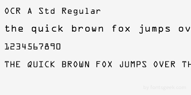

# OCR
An Implementation of OCR in desktop Using Tesseract google ocr.

# Implementation MacOs

* Step 1: Open Terminal $ cd desktop/path/ 
* Step 2: Input image name in command line argument $ python3 process_image.py "input_name.png" "output_name.png" 
* Step 3: The generated "output_name.png" is a processed image. $ python3 extract.py 
* Step 4: The output is given in console and "output.txt" in the same directory. 

* Input Image: 

* Processed Image: 

* Output Text File

1

